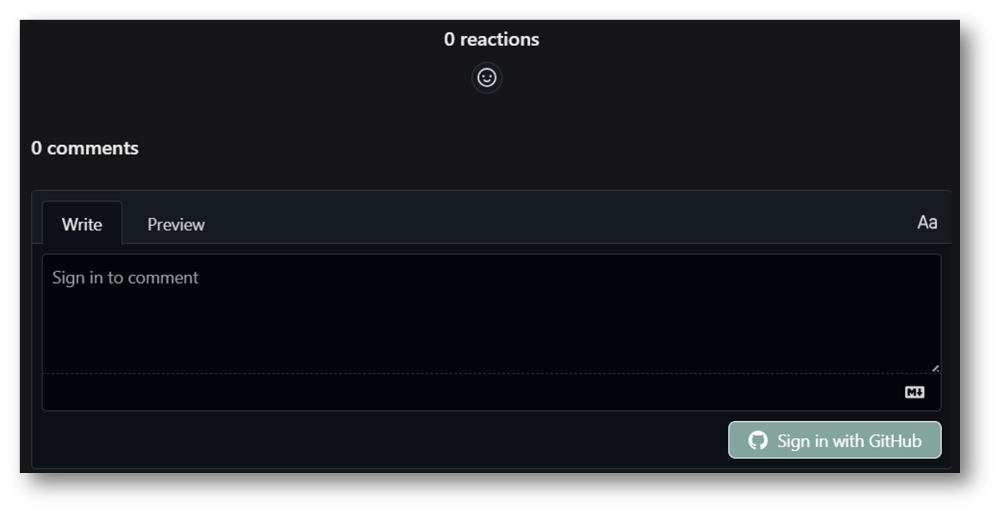

# Quartz v4

> “[One] who works with the door open gets all kinds of interruptions, but [they] also occasionally gets clues as to what the world is and what might be important.” — Richard Hammingtest

Quartz is a set of tools that helps you publish your [digital garden](https://jzhao.xyz/posts/networked-thought) and notes as a website for free.
Quartz v4 features a from-the-ground rewrite focusing on end-user extensibility and ease-of-use.

🔗 Read the documentation and get started: https://quartz.jzhao.xyz/

## Forked updates

1. Basic Config[^25-07-04]
	1. gitignore
	2. ignorepaterns
2. Giscuss comment section 
   
3. enable blog editing & history monitoring on blog posts 
   

source:

[^25-07-04]: https://quartz.jzhao.xyz/configuration#general-configuration

